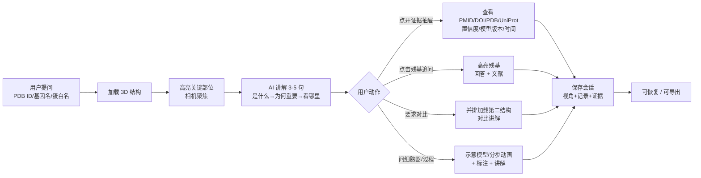

# BioSynapse 产品需求文档（PRD）

| 项 | 内容 |
|---|---|
| 产品名称 | BioSynapse |
| 文档版本 | v0.1（对应产品版本 v0.1.0-alpha） |
| 文档状态 | 评审稿 |
| 创建日期 | 2026-10-03 |
| 阶段周期 | 6 个月 / 26 周 |
| 文档性质 | 第一阶段（Phase 1）产品需求基线，后续变更须走变更记录 |
| 读者对象 | 前端/3D、后端/数据、全栈/科学内容工程师；贡献者；评审与合作教师 |

> **约定**
> - 需求编号规则：`FR-<模块>-<序号>` 为功能需求，`NFR-<序号>` 为非功能需求，`SAFE-<序号>` 为安全需求，`OSS-<序号>` 为开源合规需求。
> - 优先级：**P0** = alpha 发布阻塞项；**P1** = 阶段内应交付；**P2** = 可顺延、不阻塞发布。
> - 每条 P0/P1 需求均附可验证的验收标准（AC）。
> - 标注「示意」的内容必须在 UI 中显式声明，不得让用户误认为真实结构或真实模拟。

---

## 1. 产品概述

### 1.1 一句话定位

**6 个月内交付一个可审计的"会说话的 3D 生物大分子教学闭环"。**

用户问一个生物大分子 → 3D 结构出现 → 高亮关键部位 → AI 讲 3–5 句 → 证据抽屉可点开 → 可追问 → 可保存恢复。

### 1.2 产品背景与问题陈述

| 现存痛点 | BioSynapse 的回答 |
|---|---|
| 结构数据库（PDB、AlphaFold DB）专业门槛高，初学者不会检索、不会看 | 自然语言输入（PDB ID / UniProt ID / 基因名 / 蛋白名均可），直接出 3D |
| 静态教材与 3D 结构脱节，"结构—功能"关系靠想象 | AI 讲解与 3D 高亮、相机聚焦逐句联动，讲到哪里、亮到哪里 |
| 通用 AI 工具讲分子时幻觉频发，无法核验 | 每条事实性断言绑定证据与来源，**无源断言 = 0**，证据抽屉可点开原始文献 |
| 细胞器与生物学过程缺少可交互的轻量教学工具 | 程序化 3D 示意 + 分步动画 + 标注 + 讲解，明确标注"示意"属性 |
| 教学工具数据与模型绑定单一供应商，隐私与成本不可控 | 三模式 LLM（预生成缓存 / BYOK / 本地 Ollama），能力契约驱动交互降级 |

### 1.3 产品价值主张

- **对学生**：把"问一句、看结构、听讲解、查证据、继续追问"压缩到一个工作台，5 分钟建立"结构—功能"直觉。
- **对教师**：可保存、可恢复、可导出的可审计教学素材，每个论断都能追到 PMID / DOI / PDB / UniProt。
- **对社区**：Apache 2.0 开源、`docker compose up` 一行启动、内容与代码版本分离的科学软件基础设施。

### 1.4 第一阶段范围总览

第一阶段 = **分子层完整渲染 + 细胞器示意 + 过程示意 + 证据抽屉 + 三模式 LLM + 开源门面**。

---

## 2. 目标用户与核心场景

### 2.1 目标用户

| 用户群体 | 特征 | 核心诉求 |
|---|---|---|
| 医学生 | 需掌握蛋白结构与功能、突变致病机制 | 快速看到关键残基/配体，理解机制，能追到文献 |
| 生科本科生 | 生物化学、分子生物学课程学习 | 自然语言提问、3D 直观化、考试相关知识点 |
| 结构生物学入门研究者 | 刚开始使用 PDB / AlphaFold | 结构加载、表示切换、位点级注释与证据 |
| 教师 | 备课、课堂演示、布置探索任务 | 可保存/导出的教学场景、可审计内容、低部署成本 |

### 2.2 核心用户旅程（端到端闭环）



### 2.3 关键场景（脚本化示例，作为 Golden Demo）

| # | 场景 | 输入 | 期望系统行为 |
|---|---|---|---|
| S1 | 血红蛋白运氧 | "1HHO 怎么运氧？" | 加载血红蛋白 → 高亮血红素（heme）→ 讲解协同效应 → 证据抽屉可查 |
| S2 | 残基突变追问 | 点击 His F8 后问"突变会怎样？" | 高亮该组氨酸残基并聚焦相机 → 回答其功能影响 → 附文献证据 |
| S3 | 结构对比 | "和肌红蛋白比呢？" | 并排加载 1MBO → 链/折叠/配体对比讲解 |
| S4 | 细胞器示意 | "线粒体长什么样？" | 展示线粒体 3D 示意 → 标注嵴、内外膜、基质 → 讲解，界面标注"示意模型，非真实结构" |

> S1–S4 同时作为 `golden/` 目录下的端到端验收基准（见 §13）。

---

## 3. 产品范围

### 3.1 本期做（In Scope）

| 层级 | 支持程度 | 渲染方式 | 数据来源 |
|---|---|---|---|
| 蛋白质 / 酶 | 完整支持 | Mol* | PDB / AlphaFold DB |
| DNA / RNA | 完整支持 | Mol* | PDB / NDB |
| 糖类 | 部分支持 | Mol* 球棍 / 棒状 | PDB 配体 / GlyTouCan |
| 病毒衣壳 | 部分支持 | Mol* + 体积 | PDB / EMDB |
| 细胞器 | 示意支持 | Three.js 程序化 | 手工模型 |
| 核心过程 | 示意支持 | Three.js 动画 | 教学脚本 |

### 3.2 本期不做（Out of Scope，进入公开 Roadmap）

- 染色体 / 染色质真实结构（v0.1 仅做核小体示意）
- 完整细胞模型
- 真实动力学模拟
- 用户上传结构（v0.2）
- 主动简报（v0.2）
- AlphaFold3 / 多智能体 / 干湿闭环
- 定价页 / 订阅分层 / 付费转化

### 3.3 公开 Roadmap（阶段门）

| 版本 | 规划内容 |
|---|---|
| **v0.1（本期）** | 分子完整渲染、细胞器与过程示意、证据抽屉、三模式 LLM、会话保存恢复、开源门面 |
| v0.2 | 用户上传结构、序列/图片拖拽输入、主动简报、结构相似性初步检索 |
| v0.3 | 分子对接（去 Mock）、Neo4j 知识图谱、多结构批量对比 |
| v1.0 | 简化动力学示意、云端实验室 API 对接、体系化课程内容 |

> Roadmap 条目须带"阶段门"：仅当上一阶段对应验收标准达标后才启动下一阶段条目。

---

## 4. 功能需求

### 4.1 模块 1：3D 工作台（FR-3D）

#### FR-3D-001 结构加载（P0，M1）

**描述**：用户可通过 PDB ID 或 UniProt ID 加载实验结构（RCSB PDB）或预测结构（AlphaFold DB）。
**用户故事**：作为学生，我输入 1HHO，就能看到血红蛋白的 3D 结构，而不需要知道如何使用 RCSB 网站。

验收标准：
- [ ] 输入合法 PDB ID（如 `1HHO`）可加载对应 mmCIF/PDB 结构；输入 UniProt ID 可加载 AlphaFold DB 预测结构
- [ ] 预置结构从点击到可交互 **< 3s**（见 NFR-1）
- [ ] 加载过程中有明确的加载态指示；加载失败有可读的错误提示与重试入口
- [ ] 预测结构在 UI 中明确标注"AlphaFold 预测结构"及其置信度信息（pLDDT），不得与实验结构混淆
- [ ] 结构来源（PDB / AlphaFold）、版本、获取时间在会话中可查

#### FR-3D-002 基础视角操作（P0，M1）

**描述**：支持旋转、缩放、平移。
验收标准：
- [ ] 鼠标/触控板可旋转、缩放、平移；触屏设备支持对应手势
- [ ] 提供"重置视角"按钮
- [ ] 交互过程帧率 **> 30fps**（NFR-3）

#### FR-3D-003 表示模式切换（P0，M1）

**描述**：可在卡通（cartoon）、球棍（ball-and-stick）、空间填充（spacefill）、表面（surface）之间切换。
验收标准：
- [ ] 四种表示模式均可对当前加载结构切换
- [ ] 表示切换作用于"当前选择范围"；无选择时作用于全局
- [ ] 切换响应 **< 200ms** 级别无明显卡顿（表面等重计算允许异步并显示进度）
- [ ] 糖类默认以球棍/棒状呈现

#### FR-3D-004 高亮选择（P0，M1）

**描述**：可高亮链、残基、配体、结构域、活性位点。
验收标准：
- [ ] 支持按链、残基（链+残基号）、配体、结构域、活性位点进行高亮
- [ ] 高亮响应 **< 200ms**（NFR-2）
- [ ] 高亮对象与 AI 讲解中的断言可通过 `claim_id` 关联（见 §6）
- [ ] 可清除高亮；重复高亮同一目标时去重，不产生重叠叠加

#### FR-3D-005 点击拾取（Click-to-Select）（P0，M3）

**描述**：用户可直接点击结构中的残基/配体，获取其身份信息并可发起提问。
验收标准：
- [ ] 点击残基显示其标识（链、残基名、残基号）
- [ ] 点击后提供"问一问"入口（Click-to-Ask），提问上下文自动携带该位点信息
- [ ] 拾取基于 Mol* selection / GPU Picking，点击判定准确，无明显误拾取

#### FR-3D-006 相机聚焦（P0，M1）

**描述**：可将相机聚焦到指定残基/区域。
验收标准：
- [ ] 结构化指令或用户操作可使相机平滑聚焦到目标残基/配体
- [ ] 聚焦后目标位于可视区域合理位置，不被标注层遮挡

#### FR-3D-007 并排对比（P1，M3）

**描述**：并排加载两个结构并进行对比。
验收标准：
- [ ] 可同时加载两个结构（如 1HHO 与 1MBO），左右并排独立视图
- [ ] 两视图可选择相机联动（旋转/缩放同步），也可解除联动独立操作
- [ ] AI 可进行对比讲解，并分别在两个视图中高亮对应部位
- [ ] 两视图链选择态、表示态互不串扰

#### FR-3D-008 多类型结构渲染（P1，M4）

**描述**：扩展支持 DNA/RNA、糖类、病毒衣壳（含体积）。
验收标准：
- [ ] DNA/RNA 结构经 NDB/PDB 加载并以合适表示呈现
- [ ] 糖类以球棍/棒状正确呈现，配体来源可追溯
- [ ] 病毒衣壳支持 Mol* 结构 + EMDB 体积的呈现方式
- [ ] 超大结构（如衣壳）默认启用简化/LOD 策略，保证可交互（NFR-4）

#### FR-3D-009 渲染资源管理（P1，M1 起持续）

**描述**：前端对渲染资源进行生命周期管理。
验收标准：
- [ ] geometry / material / texture 采用 LRU 策略，超出阈值自动销毁最久未用资源
- [ ] mmCIF/PDB 解析、残基索引构建等重操作放入 Web Worker，不阻塞主线程
- [ ] 同页多视图共享 renderer；跨 tab 仅共享状态、不共享 WebGL context
- [ ] 离开/关闭视图时正确释放 WebGL 资源，无持续增长的显存泄漏

---

### 4.2 模块 2：聊天输入（FR-CHAT）

#### FR-CHAT-001 自然语言驱动（P0，M3）

**描述**：用户以自然语言驱动整个工作台。
验收标准：
- [ ] 可输入自然语言问题（如"1HHO 怎么运氧？"）
- [ ] 系统识别意图并联动：加载结构 / 高亮 / 聚焦 / 讲解 / 对比 / 示意内容
- [ ] 支持多轮追问，上下文包含当前结构、当前选择与历史对话

#### FR-CHAT-002 多标识符解析（P0，M3）

**描述**：支持 PDB ID / UniProt ID / 基因名 / 蛋白名。
验收标准：
- [ ] 直接输入 PDB ID、UniProt ID、基因名、常见蛋白名均可解析到结构
- [ ] 解析存在歧义（多个命中）时，向用户展示候选列表供选择，不静默猜测
- [ ] 无法解析时给出明确反馈与建议输入格式

#### FR-CHAT-003 位点级上下文（P0，M3）

**描述**：点击残基后的提问自动携带位点上下文。
验收标准：
- [ ] Click-to-Ask 发出的问题自动附带 `pdb / chain / resi / residue_name`
- [ ] 位点编号在送入讲解生成前完成 PDB ↔ UniProt 编号映射（见 §7.3），避免编号错位导致事实错误

#### FR-CHAT-004 拖拽输入（P2，L2/v0.2）

**描述**：支持拖拽图片 / 序列。
验收标准：
- [ ] v0.1 中可保留入口占位但明确标注"即将支持"，不提供半成品功能；完整能力在 v0.2 交付

#### FR-CHAT-005 AI 与 3D 双向联动（P0，M3）

**描述**：AI 输出可驱动 3D；3D 选择可进入 AI 上下文。
验收标准：
- [ ] AI 返回结构化 3D 指令（§6），前端可靠执行高亮、表示切换、聚焦、证据定位
- [ ] 3D 中的选择/拾取结果可作为下一轮 AI 上下文
- [ ] 模型能力不足时按能力契约自动降级（NFR-7），不出现"无响应/报错中断"

---

### 4.3 模块 3：AI 讲解 + 证据抽屉（FR-AI）

#### FR-AI-001 标准化讲解格式（P0，M2）

**描述**：默认讲解为 3–5 句，结构为"是什么 → 为什么重要 → 看哪里"。
验收标准：
- [ ] 每次结构/位点讲解默认输出 3–5 句，覆盖三个固定环节
- [ ] "看哪里"对应可执行的 3D 高亮/聚焦指令
- [ ] 讲解中每个事实性断言带唯一 `claim_id`

#### FR-AI-002 断言—证据绑定（P0，M2）

**描述**：每条事实性断言绑定 `Claim / Evidence / Source / ModelRun`。
验收标准：
- [ ] 事实性断言必须至少绑定 1 条 Evidence；**无源断言数量 = 0**（NFR-5）
- [ ] Evidence 记录与 Source 的支持关系、locator（定位信息）、quote（原文摘录）
- [ ] Source 记录类型（PMID / DOI / PDB / UniProt）、URL、retrieved_at、license
- [ ] ModelRun 记录模型名、prompt_hash、参数、生成时间
- [ ] 每条证据可区分置信层级：实验证实 / 领域共识 / 计算预测（UI 可辨识）

#### FR-AI-003 证据抽屉 UI（P0，M2）

**描述**：讲解旁提供可展开的证据抽屉。
验收标准：
- [ ] 每条讲解/断言旁有"证据"入口，可展开抽屉
- [ ] 抽屉展示：PMID / DOI / PDB / UniProt 链接、置信度、生成时间、模型版本
- [ ] 抽屉中与当前断言相关的证据可定位高亮；3D 中可同步定位证据所指结构对象
- [ ] **所有外链可解析，可解析率 = 100%**（NFR-6），点击可到达正确的原始来源页面
- [ ] 外链统一经后端跳转代理，便于链接规则维护与死链巡检

#### FR-AI-004 预生成讲解缓存（P0，M1）

**描述**：Top 50 教学蛋白的讲解与结构文件预生成、构建时预取。
验收标准：
- [ ] 覆盖 Top 50 教学蛋白，新用户零配置即可使用
- [ ] 缓存内容不仅含讲解文本，还含与讲解对齐的 3D 指令序列（讲到哪里、高亮哪里）
- [ ] 缓存模式下首 token（首条内容呈现）**< 2s**（NFR-1）
- [ ] 缓存内容同样满足证据绑定要求，不因缓存而绕过可审计性

#### FR-AI-005 讲解的拒答与边界（P0，M2）

**描述**：对超出证据范围或触发安全策略的问题拒答。
验收标准：
- [ ] 无可靠证据支持的事实性问题，明确说明"暂无可靠来源支持"，不编造
- [ ] 触发生物安全策略的请求按 §9 处理
- [ ] 预测结构相关结论明确标注不确定性（pLDDT/预测性质）

---

### 4.4 模块 4：会话管理（FR-SES）

#### FR-SES-001 会话保存（P0，M3）

**描述**：保存 3D 视角 + 聊天记录 + 证据状态。
验收标准：
- [ ] 一次保存包含：当前结构及来源、相机视角、高亮/表示状态、完整聊天记录、证据与断言数据
- [ ] 保存有明确成功反馈

#### FR-SES-002 会话恢复（P0，M3）

**描述**：已保存会话可完整恢复。
验收标准：
- [ ] 恢复后 3D 视角、高亮、聊天记录、证据抽屉状态与保存时一致
- [ ] 恢复的外部结构在来源可用时重新拉取；来源不可用时使用缓存并明确提示

#### FR-SES-003 会话导出（P1，M3）

**描述**：会话可导出。
验收标准：
- [ ] 支持导出为可移植格式（含聊天、证据清单、结构标识与视角参数）
- [ ] 导出内容保留来源 URL、retrieved_at、模型版本等审计字段

#### FR-SES-004 Demo 可复现（P0，M3）

**描述**：产出一个 30 秒 Demo GIF 且流程可复现。
验收标准：
- [ ] 存在 30 秒 Demo GIF，展示"提问 → 加载 → 高亮 → 讲解 → 证据"主闭环
- [ ] 按文档步骤可在本地复现 GIF 中的完整流程

---

### 4.5 模块 5：细胞器示意（FR-ORG）

#### FR-ORG-001 细胞器清单（P1，M5）

**描述**：提供 8–10 个标准细胞器。
验收标准：
- [ ] 至少包含：细胞核、线粒体、内质网、高尔基体、溶酶体、核糖体、细胞膜、叶绿体（共 8 个，可扩展至 10 个）
- [ ] 每个细胞器包含：3D 示意模型 + 结构标注 + AI 讲解 + 证据

#### FR-ORG-002 示意属性声明（P0，M5）

**描述**：明确区分示意与真实结构。
验收标准：
- [ ] 细胞器视图中持续可见"示意模型，非真实结构"声明
- [ ] 不得在任何讲解/文案中将示意模型表述为真实测定结构

#### FR-ORG-003 标注与讲解（P1，M5）

验收标准：
- [ ] 各细胞器关键结构有标注（如线粒体：外膜、内膜/嵴、基质）
- [ ] 点击/悬停标注可聚焦对应部位并给出讲解
- [ ] 讲解同样接入证据体系（FR-AI-002）

---

### 4.6 模块 6：核心过程示意（FR-PROC）

#### FR-PROC-001 过程清单（P1，M5）

**描述**：提供 3–5 个核心生物学过程的分步动画。
验收标准：
- [ ] 覆盖 3–5 个，候选：ATP 合成、酶催化、GPCR 信号、DNA 复制、转录、翻译（6 选 3–5）
- [ ] 每个过程包含：分步动画 + 关键分子高亮 + AI 分步讲解

#### FR-PROC-002 分步控制（P1，M5）

验收标准：
- [ ] 提供播放/暂停、上一步/下一步、步骤导航
- [ ] 每一步有关键分子高亮与对应讲解
- [ ] 过程中涉及的真实分子（如 ATP、酶）可链接到对应真实结构视图

#### FR-PROC-003 示意属性声明（P0，M5）

验收标准：
- [ ] 过程动画视图中持续可见"教学示意，非动力学模拟"声明
- [ ] 不呈现任何可能被误解为真实动力学参数（速率、力、自由能轨迹）的定量内容，除非有明确来源并标注

---

### 4.7 模块 7：异步任务队列（FR-QUEUE）

#### FR-QUEUE-001 队列基础设施（P1，M2 起）

**描述**：基于 Redis + BullMQ 建立异步任务队列。
验收标准：
- [ ] 队列可接收、调度、追踪异步任务，有任务状态（等待/运行中/完成/失败）
- [ ] 失败任务有重试与错误记录

#### FR-QUEUE-002 分子对接 Mock（P2，M5 前）

**描述**：分子对接在第一阶段使用 Mock，不做真实对接。
验收标准：
- [ ] 对接任务走完整队列流程但返回 Mock 结果，并明确标注"演示/Mock 结果"
- [ ] 队列与"云端实验室 API"保持解耦，后续可替换为真实实现而不改前端契约

---

## 5. 功能需求优先级—里程碑映射总表

| 需求编号 | 名称 | 优先级 | 里程碑 |
|---|---|---|---|
| FR-3D-001 | 结构加载 | P0 | M1 |
| FR-3D-002 | 基础视角操作 | P0 | M1 |
| FR-3D-003 | 表示模式切换 | P0 | M1 |
| FR-3D-004 | 高亮选择 | P0 | M1 |
| FR-3D-006 | 相机聚焦 | P0 | M1 |
| FR-3D-009 | 渲染资源管理 | P1 | M1 起 |
| FR-AI-004 | 预生成讲解缓存（Top 50） | P0 | M1 |
| FR-AI-001 | 标准化讲解格式 | P0 | M2 |
| FR-AI-002 | 断言—证据绑定 | P0 | M2 |
| FR-AI-003 | 证据抽屉 UI | P0 | M2 |
| FR-AI-005 | 拒答与边界 | P0 | M2 |
| FR-QUEUE-001 | 队列基础设施 | P1 | M2 起 |
| FR-CHAT-001 | 自然语言驱动 | P0 | M3 |
| FR-CHAT-002 | 多标识符解析 | P0 | M3 |
| FR-CHAT-003 | 位点级上下文 | P0 | M3 |
| FR-CHAT-005 | AI 与 3D 双向联动 | P0 | M3 |
| FR-3D-005 | 点击拾取 Click-to-Select | P0 | M3 |
| FR-3D-007 | 并排对比 | P1 | M3 |
| FR-SES-001/002/004 | 保存 / 恢复 / Demo 复现 | P0 | M3 |
| FR-SES-003 | 会话导出 | P1 | M3 |
| FR-3D-008 | 多类型结构渲染 | P1 | M4 |
| FR-ORG-001/003 | 细胞器清单与讲解 | P1 | M5 |
| FR-ORG-002 | 细胞器示意声明 | P0 | M5 |
| FR-PROC-001/002 | 过程动画与分步控制 | P1 | M5 |
| FR-PROC-003 | 过程示意声明 | P0 | M5 |
| FR-QUEUE-002 | 分子对接 Mock | P2 | M5 前 |
| FR-CHAT-004 | 拖拽输入 | P2 | v0.2 |

---

## 6. 3D 与 LLM 联动协议（结构化指令契约）

### 6.1 指令格式

LLM 输出结构化指令驱动前端，标准示例：

```json
{
  "action": "highlight",
  "target": {"pdb": "1HHO", "chain": "A", "resi": 87},
  "style": "ball-and-stick",
  "camera": "focus",
  "claim_id": "c_1024"
}
```

### 6.2 Action 枚举（v0.1）

| action | 含义 | 必要字段 |
|---|---|---|
| `load_structure` | 加载结构 | `target.pdb` 或 `target.uniprot` |
| `highlight` | 高亮目标 | `target`（链/残基/配体/结构域/活性位点） |
| `set_representation` | 切换表示 | `style`：cartoon / ball-and-stick / spacefill / surface |
| `focus_camera` | 相机聚焦 | `target` |
| `clear_highlight` | 清除高亮 | 可选 `target`；缺省清除全部 |
| `compare` | 并排对比 | 两个结构目标 |
| `open_evidence` | 打开证据抽屉并定位 | `claim_id` |
| `play_process` / `step` | 播放/步进过程动画 | 过程标识、步骤号 |

### 6.3 前端执行与容错要求

- [ ] 支持函数调用的模型直接输出结构化 JSON；不支持时走"文本 + 代码块提取"的降级路径
- [ ] 解析时优先提取 ```json 代码块，做宽松校验，缺失字段以默认值补全；非法指令不得导致页面崩溃
- [ ] 所有指令执行须幂等：重复 `highlight` 去重；`clear_highlight` 可重复执行
- [ ] 每条指令与 `claim_id` 关联，保证"讲解—高亮—证据"三者可互相跳转
- [ ] 无法识别的指令静默忽略并记录日志，同时向用户给出可理解的反馈

---

## 7. 数据需求

### 7.1 数据源与优先级

| 优先级 | 数据源 | 用途 | 接口 |
|---|---|---|---|
| P0 | RCSB PDB | 实验结构 | `rcsb-api` |
| P0 | AlphaFold DB | 预测结构 | Structure Extractor |
| P0 | UniProt | 序列 / 功能注释 | REST API |
| P0 | Europe PMC | 文献证据 | REST API |
| P1 | NDB | 核酸结构 | FTP / API |
| P1 | EMDB | 病毒衣壳体积 | `emdb-api-wrapper` |
| P2 | GlyTouCan | 糖类 | API |

### 7.2 三层数据策略

1. **预生成缓存**：Top 50 教学蛋白讲解 + 结构文件，构建时预取，新用户零配置。
2. **实时 API 按需拉取**：非预置结构，后端调用 RCSB / AlphaFold / UniProt / Europe PMC。
3. **批量同步**：后期对高频数据集做本地镜像。

所有外部数据源访问必须经过**适配器层**，数据源 API 变更时仅改适配器；适配器须支持缓存与降级。

### 7.3 核心数据模型

```mermaid
erDiagram
    Claim ||--o{ Evidence : "被支持于"
    Source ||--o{ Evidence : "提供"
    ModelRun ||--o{ Claim : "生成"
    Claim ||--o{ Review : "被复核"
    Structure ||--o{ Claim : "关于"
    SiteMapping ||--|| Structure : "对齐编号"

    Claim {
        string claim_id PK
        text assertion
        string confidence_level "实验证实/领域共识/计算预测"
        string model_run_id FK
        string structure_ref
        datetime created_at
    }
    Evidence {
        string evidence_id PK
        string claim_id FK
        string source_id FK
        string locator
        text quote
        string support_type
    }
    Source {
        string source_id PK
        string source_type "PMID/DOI/PDB/UniProt"
        string url
        string license
        datetime retrieved_at
    }
    ModelRun {
        string model_run_id PK
        string model
        string prompt_hash
        json params
        datetime generated_at
    }
    Review {
        string review_id PK
        string claim_id FK
        string status
        string reviewer
    }
    Structure {
        string structure_id PK
        string source "PDB/AlphaFold/NDB/EMDB"
        string version
        string scale
        string resolution
        string coordinate_system
        string units
        string license
        datetime retrieved_at
    }
    SiteMapping {
        string id PK
        string pdb_id
        string chain
        string uniprot_id
        int residue_offset
    }
```



**模型清单（v0.1 实现，v0.2 扩展）**：

| 模型 | v0.1 | 说明 |
|---|---|---|
| `Claim` | ✅ | AI 断言 |
| `Evidence` | ✅ | claim 与 source 的支持关系、locator、quote |
| `Source` | ✅ | PMID / DOI / PDB / UniProt、URL、retrieved_at、license |
| `ModelRun` | ✅ | 模型、prompt_hash、参数、生成时间 |
| `Review` | ✅ | 人工复核状态 |
| `Structure` / `SiteMapping` | ✅ | 结构元数据与 PDB↔UniProt 位点映射 |
| `Upload` / `UserStructure` | ⛔ v0.2 | 用户上传相关 |

### 7.4 关键科学元数据字段（不可省略）

`scale`（尺度）、`resolution`（分辨率）、坐标系、单位、版本、不确定性、license、retrieved_at。

> 这些字段用于防止"尺度/单位/坐标系混淆"这一类科学软件高发错误，并支撑可审计与可复现。

---

## 8. 非功能需求（NFR）

| 编号 | 类别 | 需求 | 验收方式 |
|---|---|---|---|
| NFR-1 | 性能 | 预置结构加载到可交互 **< 3s**；缓存模式首 token **< 2s** | 基准环境下自动性能测试（CI 中记录） |
| NFR-2 | 性能 | 高亮响应 **< 200ms** | 交互计时采样 |
| NFR-3 | 性能 | 常规交互 **> 30fps** | 帧率采样（典型结构与超大结构分档） |
| NFR-4 | 性能/可靠性 | 大结构不崩溃：原子数 > 5 万自动 LOD/实例化；衣壳默认体积+外壳简化 | 超大结构加载用例 |
| NFR-5 | 可审计 | 无源断言 = 0 | 断言扫描（发布阻断检查） |
| NFR-6 | 可审计 | 外链可解析率 = 100%；过时引用比例 < 5% | 链接巡检脚本 + 定期任务 |
| NFR-7 | 兼容性 | 按 LLM 能力契约（`can_stream / can_call_functions / max_context / supports_vision`，建议补充 `can_structured_output / can_control_3d`）做交互降级 | 三模式 × 能力组合走查 |
| NFR-8 | 可部署性 | `docker compose up` 一行启动，**5 分钟内**打开本地页面；自动拉起 Postgres+pgvector、Redis、前端；不拉 Neo4j | 干净环境从零部署计时 |
| NFR-9 | 可维护性 | 数据版本与代码版本分离；`golden/` 存预期输出；每次 PR 跑 lint + test | CI 配置与目录检查 |
| NFR-10 | 可靠性 | 数据源失败时缓存兜底/明确降级提示，不白屏 | 断网/接口故障注入测试 |
| NFR-11 | 浏览器兼容 | 支持主流桌面浏览器（Chrome/Edge/Firefox）WebGL2；不支持 WebGL2 时给出明确提示 | 浏览器矩阵走查 |

---

## 9. 安全与生物安全护栏（SAFE）

### 9.1 三层硬编码护栏

| 层级 | 机制 | v0.1 落地要求 |
|---|---|---|
| 1. 输入筛查 | 危险序列、致病性增强、双重用途关键词 | 关键词/特征筛查；命中即进入受控流程 |
| 2. 模型拒答 | 高致病性序列生成、增强致病性实验设计 | 系统提示植入规则 + 策略层直接拒绝 |
| 3. 输出审核 | 合成订单拦截、人工专家复核、审计日志、双人审批 | 后端输出拦截；全量审计日志；高风险项双人审批 |

### 9.2 安全需求条目

- **SAFE-001（P0）**：输入/输出全量留痕（谁、何时、何模型、何内容、何 3D 动作），审计日志不可由普通用户删除。
- **SAFE-002（P0）**：最终安全判定必须在**后端**执行，前端仅做提示；禁止仅在前端实现安全拦截。
- **SAFE-003（P1）**：筛查误报进入人工复核队列，复核结论记录在案。
- **SAFE-004（P1）**：遵循 IGSC 筛查标准、出口管制、机构伦理审查要求。
- **SAFE-005（P0）**：`safety/` 为独立可审计模块，随仓库分发。

### 9.3 开源后的特殊处理

- README 声明：**"移除安全模块的 fork 不被视为官方发行版"**。
- `SECURITY.md` 分两条报告路径：**软件漏洞** 与 **生物安全关注**，分别给出响应流程。

---

## 10. 开源与合规需求（OSS）

### 10.1 第一周必须就位的仓库门面（M0）

```
├── README.md              # 这是什么，怎么跑
├── LICENSE                # Apache 2.0
├── CONTRIBUTING.md        # 怎么贡献
├── CODE_OF_CONDUCT.md
├── SECURITY.md
├── CITATION.cff           # 学术身份证
├── SAFETY.md
└── GOVERNANCE.md          # 三级权限：Contributor / Reviewer / Maintainer
```

- **OSS-001（P0）**：以上文件在 M0 齐备；README 含一键启动说明与最小 Demo。
- **OSS-002（P0）**：GitHub Actions 每个 PR 执行 lint + test。
- **OSS-003（P1）**：`golden/` 按模块组织（结构解析 / 对话 / 证据绑定基准）。
- **OSS-004（P1）**：`GOVERNANCE.md` 明确 Contributor / Reviewer / Maintainer 三级权限与晋升路径。

### 10.2 许可证分层

| 模块 | 许可证 |
|---|---|
| 3D 工作台、聊天、教学层 | Apache 2.0 |
| LLM 抽象层、数据源适配器 | Apache 2.0 |
| 预生成教学内容 | CC-BY 4.0 |
| 未来序列生成模块（L3） | OpenRAIL-M |
| 用户贡献标注数据 | 贡献者保留版权，授权项目使用 |

- **OSS-005（P0）**：`CONTRIBUTING.md` 必须写明：**提交 PR 即同意以对应模块许可证授权**。

---

## 11. 技术架构约束（供开发参考，非需求主体）

```mermaid
flow TB
    subgraph Client[前端 · Next.js 14 + Tailwind]
        UI[聊天/抽屉/会话 UI]
        Molstar[Mol* 主分子画布<br/>解析/表示/拾取/渲染]
        R3F[R3F 覆盖层<br/>标注/辅助几何/细胞器/过程动画]
        Store[Zustand 状态]
        Worker[Web Worker<br/>解析/索引/表面计算]
    end
    subgraph Server[后端]
        API[API 服务]
        Adapter[数据源适配器<br/>PDB/AF/UniProt/PMC/NDB/EMDB/GlyTouCan]
        LLM[LLM 抽象层 · 能力契约<br/>缓存/BYOK/Ollama]
        Queue[BullMQ + Redis]
    end
    subgraph Data[数据]
        PG[(Postgres + pgvector)]
        Cache[(预生成缓存/对象存储)]
    end
    UI --> Store
    Store <--> Molstar
    Store <--> R3F
    Molstar --> Worker
    API --> Adapter
    API --> LLM
    API --> Queue
    API --> PG
    API --> Cache
```

**关键约束（硬性）**：

1. Mol* 管 3D 画布；R3F 只做 DOM 覆盖层 / 标注 / 示意，不接管分子主场景。
2. 双 Canvas 堆叠时须做相机参数同步（位置、朝向、FOV），保证标注与分子空间对齐。
3. 同页多视图共享 renderer；跨 tab 只共享状态，不共享 WebGL context。
4. LRU 销毁 geometry / material / texture；解析放 Web Worker。
5. 知识层 MVP 用 Postgres + pgvector；Neo4j 后置到 L2。
6. LLM 是**能力契约**而非简单 SDK 封装；前端据契约降级。
7. 部署形态为 `docker compose up`，自动拉起 Postgres+pgvector、Redis、前端。

**LLM 三模式**：① 预生成缓存兜底；② BYOK 为主；③ Ollama 本地模型作进阶。

---

## 12. 里程碑与排期（6 个月 / 26 周）

| 里程碑 | 周 | 目标 | 主要交付物 |
|---|---|---|---|
| M0 | 1–2 | 仓库门面 + 技术验证 | README、LICENSE、CONTRIBUTING、CITATION.cff、SAFETY.md、GOVERNANCE.md、docker compose 骨架 |
| M1 | 3–6 | 单蛋白渲染 + 预生成缓存 | Mol* 加载 1HHO、旋转、高亮、50 个预生成讲解 |
| M2 | 7–10 | LLM 抽象层 + 证据抽屉 | 三模式 LLM、Claim/Evidence/Source/ModelRun、证据抽屉 UI |
| M3 | 11–14 | 交互闭环 + 会话管理 | 聊天输入、Click-to-Ask、保存恢复、30 秒 Demo GIF |
| M4 | 15–18 | 扩展分子类型 | DNA/RNA、糖类、病毒衣壳 |
| M5 | 19–22 | 细胞器 + 过程示意 | 8–10 个细胞器、3–5 个核心过程 |
| M6 | 23–26 | 打磨、测试、发布 | 验收测试、性能优化、v0.1.0-alpha 发布 |

**阶段门要求**：每个里程碑结束须对照 §13 对应条目验收，未达标不进入下一阶段扩张性开发。

**建议的风险缓冲（产品侧）**：
- M1 Mol* 定制化（高亮/拾取/表示）易超时，建议预留 1 周缓冲，第 4 周先跑通"加载+旋转+基础高亮"最小闭环。
- M2 证据自动校验分两步：先打通"人工绑定证据"全链路，再做自动拉取与校验。
- 建议第 14 周（M3 末）做一次 5–10 人内部 Alpha 试用（医学生/教师），反馈在 M4–M5 同步消化。
- M5 末起在 CI 中加入性能基准，避免性能问题堆积到 M6。

---

## 13. 验收标准（v0.1.0-alpha 发布门槛）

### 13.1 功能验收

- [ ] `docker compose up` 后 **5 分钟内**打开本地页面
- [ ] 加载 1 个预置 PDB / AlphaFold 结构，**< 3s** 可交互
- [ ] 点击残基 / 结构域，出现 AI 讲解
- [ ] 每条讲解旁有"证据抽屉"，可点开 PMID / DOI / PDB
- [ ] 支持 BYOK 与预生成缓存两种模式
- [ ] 会话可保存、恢复
- [ ] 30 秒 Demo GIF 可复现
- [ ] Golden 场景 S1–S4（§2.3）全部走通

### 13.2 性能验收

- [ ] 加载 < 3s
- [ ] 高亮 < 200ms
- [ ] 缓存模式首 token < 2s
- [ ] 交互 > 30fps

### 13.3 可审计性验收

- [ ] 链接可解析率 = 100%
- [ ] 引用支持性人工抽检 ≥ 95%
- [ ] 无源断言 = 0
- [ ] 过时引用比例 < 5%

### 13.4 教学效果验收

- [ ] 学生 5 分钟内能说出 3 个"结构—功能"关系
- [ ] 并主动追问至少 1 个问题

### 13.5 增长验收

- [ ] 100 种子用户
- [ ] 周留存 ≥ 35%
- [ ] 10 个教师 / 实验室试用

---

## 14. 成功指标（北极星体系）

本期不以商业付费为导向，北极星与护栏指标如下：

| 维度 | 指标 |
|---|---|
| 北极星 | **活跃贡献者数** |
| 分发 | 安装量 / 部署量 |
| 内容 | 题库 / 教学条目贡献数 |
| 生态 | 机构合作数、教师试用数 |
| 质量护栏 | 无源断言 = 0、链接可解析率 100%、引用支持率 ≥ 95% |
| 留存 | 周留存 ≥ 35% |

（明确替代旧商业口径：付费转化率、订阅分层测试、ARPU、获客成本均不纳入 v0.1 考核。）

---

## 15. 团队与成本

### 15.1 最小团队配置

| 角色 | 人数 | 职责 |
|---|---|---|
| 前端 / 3D | 1 | Mol*、R3F、UI |
| 后端 / 数据 | 1 | API、数据源、任务队列 |
| 全栈 / 科学 | 1 | LLM 抽象层、证据模型、科学内容 |

### 15.2 成本

| 项 | 估算 |
|---|---|
| 预生成缓存 | 一次性 API 成本，可控 |
| BYOK | 用户承担 |
| Ollama | 零成本 |
| 对象存储 | 低 |
| CI/CD | GitHub Actions 免费额度 |
| 域名 / 托管 | 低 |

---

## 16. 风险登记册与应对

| 风险 | 影响 | 应对 |
|---|---|---|
| 数据源 API 变更 | 结构/证据拉取失败 | 适配器层 + 缓存 + 降级 |
| Mol* 与 R3F 冲突 | 标注错位、渲染异常 | Mol* 管画布，R3F 仅覆盖层；相机参数同步 |
| WebGL 性能崩溃 | 大结构不可用 | 实例化 + LRU + LOD + Worker；衣壳简化渲染 |
| LLM 幻觉 | 错误科学结论 | 证据抽屉 + 无源断言 = 0 + 明确拒答 |
| 安全筛查误报 | 正常请求被拦 | 人工复核 + 审计日志 |
| 贡献者流失 | 社区停滞 | 72 小时响应 + good first issue + 三级成长路径 |
| 维护者 burnout | 项目停摆 | 机构支持、培训、合规审计可收费；后期申请 CZI、Sloan 资助 |

---

## 17. 附录

### 17.1 术语表

| 术语 | 含义 |
|---|---|
| PDB | Protein Data Bank，实验测定的生物大分子结构数据库 |
| AlphaFold DB | 蛋白质结构预测数据库 |
| UniProt | 蛋白质序列与功能注释数据库 |
| NDB | Nucleic Acid Database，核酸结构数据库 |
| EMDB | Electron Microscopy Data Bank，电镜体积数据库 |
| GlyTouCan | 糖类结构数据库 |
| Europe PMC | 生物医学文献数据库 |
| Claim / Evidence / Source | 断言 / 证据 / 来源，可审计性三级对象 |
| ModelRun | 一次模型生成的可复现记录（模型、prompt_hash、参数、时间） |
| BYOK | Bring Your Own Key，用户自带模型 API Key |
| BullMQ | 基于 Redis 的 Node.js 任务队列 |
| pgvector | Postgres 向量检索扩展 |
| Mol* | 分子 3D 可视化框架 |
| R3F | React Three Fiber，React 的 Three.js 封装 |
| IGSC | International Gene Synthesis Consortium，基因合成筛查标准 |

### 17.2 需求变更记录

| 版本 | 日期 | 变更摘要 | 作者 |
|---|---|---|---|
| v0.1 | 2026-10-03 | 基于《BioSynapse 第一阶段开发方案 v0.1》生成首版 PRD 基线 | — |

### 17.3 待澄清事项（进入评审）

1. Top 50 教学蛋白的具体清单与收录标准（建议由科学负责人 + 试用教师共同确定）。
2. 会话导出的目标格式（建议 JSON 为机器格式、PDF/HTML 为阅读格式，需确认 v0.1 范围）。
3. 3–5 个核心过程动画的最终选单。
4. 链接巡检与引用抽检的执行频率与责任人。
